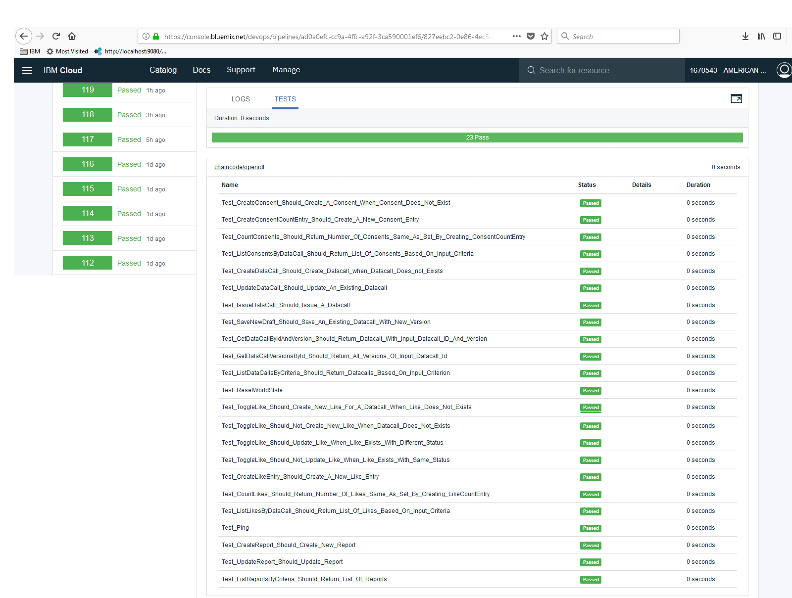

# openIDL chaincode
[](https://bluemix.net)

This repository contains one smart contract (aka chaincode) component for the openIDL network:
* `openIDLCC` - This chaincode component is installed and instatiated on the following three channels:
     * defaultchannel
     * aais-carriers
     * aais-carrier1

Please note that the `openIDLCC` chaincode component is implemented in the [GO](https://golang.org/) language.

## Key Entities
The following are the main entities (aka structures) defined in the `openIDLCC` chaincode component:

1. DataCall - Records of this type reside on the defaultchannel.
1. Report - Records of this type reside  on the defaultchannel.
1. Like - Records of this type reside on the aais-carriers and aais-carrier1 channels.
1. Consent - Records of this type reside on the aais-carriers and aais-carrier1 channels.

## Compiling and running test cases locally

### Platform
It is stronly recommended to use **macOS** or a **Linux** flavor (such as Ubuntu) for compiling and testing the chaincode components. Attempting to execute the subsequent steps on a Windows system may result in unexpected errors. See the [Prerequisites](https://hyperledger-fabric.readthedocs.io/en/release-1.1/prereqs.html#windows-extras) documentation on the Fabric web site for further details on using Windows and its nuances.

### Prerequistes
1) Before you attempt to compile and run the tests cases for the chaincode components, please make sure you have the necessary [pre-requisites](https://hyperledger-fabric.readthedocs.io/en/release-1.2/prereqs.html) on your system:

* GO programming language (v1.10.x)
* Python (v2.7)

2) Once you have GO and Python installed on your system, you should download the Fabric v1.2.1 files. To do so, you can access the following URL from your browser: `https://github.com/hyperledger/fabric/archive/v1.2.1.tar.gz`. As an alternative, you can execute the following command from your command line:

```
curl -O -L https://github.com/hyperledger/fabric/archive/v1.2.1.tar.gz
```

After downloading the Fabric files, you should untar the archive. You can do so by executing the following command:

```
tar -xvf v1.2.1.tar.gz
```

Untarring the above file results in the creation of a folder named `fabric-1.2.1`. You should now move the contents of the `fabric-1.2.1` folder into the following folder `${GOPATH}/src/github.com/hyperledger/fabric` (you may need to first create the `${GOPATH}/src/github.com/hyperledger/fabric` folder).

**Note**: Unfortunately, at the time of writing, the GO languge does not have yet an official dependency manager tool. Hence, the need for the steps described here for downloading the Fabric v1.2.1 archive, untarring it, and copying the files to the corresponding folder.

3) Finally, you'll also need to download the following assert library before proceeding with steps in the next section:

```
go get github.com/stretchr/testify/assert
```

### Steps
Please note that setting up a local Hyperledger Ffabric network is beyond the scope of this document. For details on how to do so, please see [Building Your First Network](https://hyperledger-fabric.readthedocs.io/en/release-1.2/build_network.html) documentation available on the Hyperledger Fabric website.

1) You should clone this repository into the `src` folder of your `GOPATH` folder (it is assumed you have configured your GO development environment and the `GOPATH` environment variable is set accordingly).

2) Navigate to the folder where you cloned this repository and go to the `chaincode/openidl` sub-folder.

3) Once in the `chaincode/openidl` sub-folder, let's run `go build` to compile the chaincode (please note there will not be any output message if compilation was successful:

```
$ pwd
$GOPATH/src/openidl-chaincode/chaincode/openidl
$ go build
```

After compiling the chaincode, you should see an executable file named `openidl` in the `chaincode/openidl` sub-folder.

4) To run the automated test cases for the chaincode, execute `go test` in the `chaincode/openidl` sub-folder. All tests should succeed; you should see a `PASS ok` message near the end of the output, similar to the following:

```
$ go test
Test_CreateConsent_Should_Create_A_Consent_When_Consent_Does_Not_Exist
2018-12-05 08:39:25.317 EST [openIDLCC_Logger] Info -> INFO 001 ListConsentsByDataCall: Key  [Consent_Key_ Data_Call_123 1]
2018-12-05 08:39:25.317 EST [mock] HasNext -> ERRO 002 HasNext() couldn't get Current
2018-12-05 08:39:25.317 EST [openIDLCC_Logger] Info -> INFO 003 ListConsentsByDataCall: Likes fetched for current channel, moving on to other channels
2018-12-05 08:39:25.317 EST [openIDLCC_Logger] Info -> INFO 004 InvokeChaincodeOnChannel: currentChannelID >  aais-carriers
2018-12-05 08:39:25.317 EST [openIDLCC_Logger] Info -> INFO 005 ListConsentsByDataCall: Key  [Consent_Key_ Data_Call_123 1]
2018-12-05 08:39:25.318 EST [mock] HasNext -> ERRO 006 HasNext() couldn't get Current
2018-12-05 08:39:25.318 EST [mock] HasNext -> ERRO 007 HasNext() couldn't get Current
2018-12-05 08:39:25.318 EST [openIDLCC_Logger] Info -> INFO 008 ListConsentsByDataCall: No Consent found on current channel, proceed to next channel 
2018-12-05 08:39:25.318 EST [openIDLCC_Logger] Info -> INFO 009 InvokeChaincodeOnChannel: currentChannelID >  aais-carrier1

...

Test_ListReportsByCriteria_Should_Return_List_Of_Reports
2018-12-05 08:39:25.323 EST [openIDLCC_Logger] Error -> ERRO 05d DataCallID is empty!!
err_message_getDataCallVersions > ListReportsByCriteria: failed to get list of Reports: not implementedPASS
ok  	_/Users/olivieri/git/openIDL-release2/openidl-chaincode/chaincode/openidl	0.060s
```

## Deployment to the IBM Cloud
The automated deployment of the `openIDLCC` chaincode component to the IBM Blockchain Platform is driven by the [openidl-chaincode](https://console.bluemix.net/devops/toolchains/707d43f4-7ed2-4bc4-ac90-7f31fe980648?env_id=ibm:yp:us-south) DevOps toolchain on the IBM Cloud. Hence, whenever new changes are committed and pushed to the master branch of this repo, a new build is automatically kicked off. The automated build process also executes the test cases and, if they are successful, it finally deploys the `openIDLCC` component to the IBM Cloud. The TEST stage in the [openidl-chaincode-v2-cc-pipeline](https://console.bluemix.net/devops/pipelines/ad0a0efc-cc9a-4ffc-a92f-3ca590001ef6?env_id=ibm:yp:us-south) DevOps pipeline generates a test report that should look as follows (when all tests are successful):

<p align="center"></p>