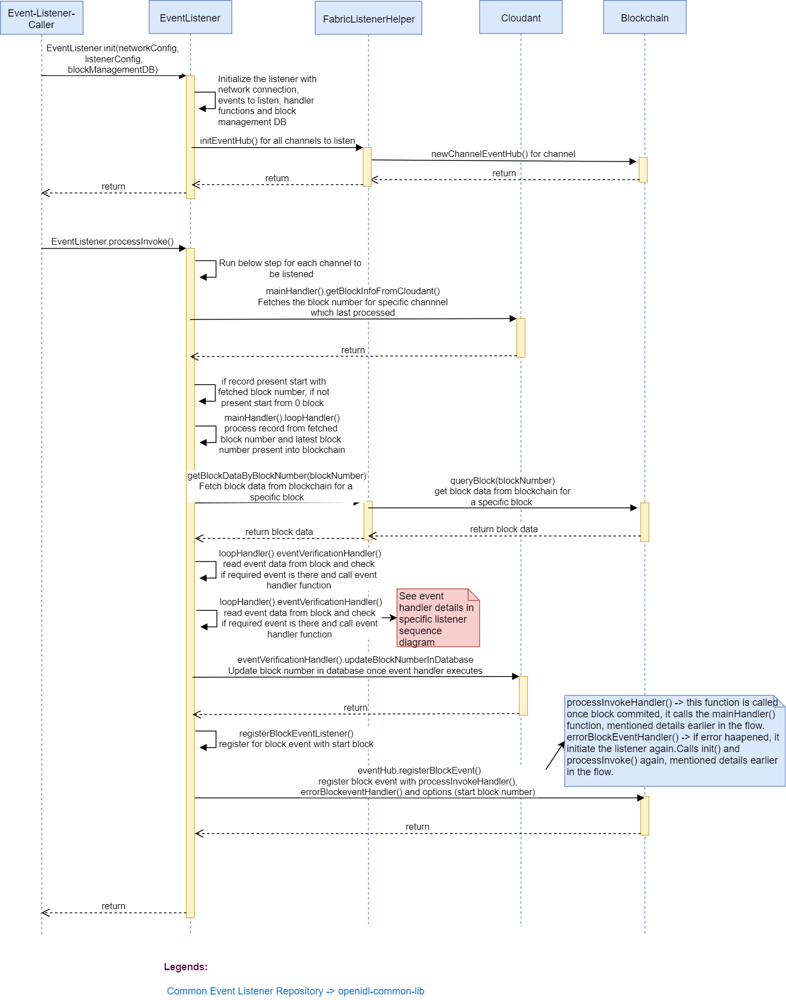

# openIDL-common-lib

This repository contains common functionality and logic leveraged by several of the openIDL applications such as the [OpenIDL Data Call App](https://git.ng.bluemix.net/openIDL/openidl-data-call-app) and the [OpenIDL Data Call Carrier App](https://git.ng.bluemix.net/openIDL/openidl-data-call-carrier-app).

The openIDL-common-lib repository includes functionality for:
* Transacting on the Fabric network
* [Processing block events](https://git.ng.bluemix.net/openIDL/openidl-common-lib/blob/develop/EventHandler.md)
* Authenticating users and components (API authentication)
* Wallets for Fabric identities
* Accessing line of businesses from the ledger
* Local Couch DB as persistent wallet

### Install Node.js
If you do not have Node.js installed already, [download](https://nodejs.org/en/download/releases/) and install Node.js v14.17.x (please note that other Node.js versions may not be compatible with this codebase). Also, make sure that the npm version you have is v6.14.x

### Install npm dependencies
1. Run the `npm install` command.

### Sequence diagram for common event listener

