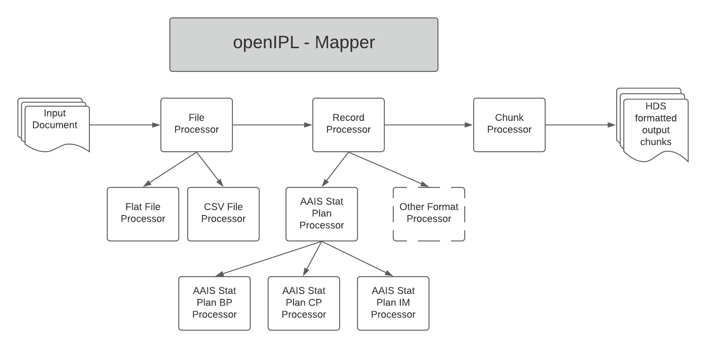

# openidl-mapper
- a reference implementation for mapping from anything to the harmonized data store
- we use a cartridge style where different transformations are plugged in when needed
- this project should be includable by any project that needs to map into thee harmonized data store
- the actual logic that understands the input format and the mapping may be in a separate project

# implementing a processor
- use BPProcessor as an example
- common mappings go into HDSProcessor

## modular architecture


The entry point for the mapper is the FileProcessor.js.
- use either processCSVRecords or processTextRecords respectively

This will call the chunk processor processIntoChunks

The chunk processor splits the batch up into a json payload for each collection of "chunkSize" records.  For CSV records, they are converted to json that should look like the flat json used later.

These are what will be passed to the insurance-data-manager as a payload.

When the chunk processor is called, the file processor passes in the function to use to convert the records.

In this case, it is the LOBProcessor.convertFlatToHDS or convertCSVToHDS.  This allows for plugin transforms.

For each record in the input file, the chunk processor will call the transformation function and add the result to the chunk.

The LOBProcessor creates a dictionary of the processors by lob code.

When called to convert a record, it determines the lob and calls the appropriate transform.

For flat files, the text record is first converted into a flat json format.  For csv's it is assumed to be in the flatJson format.

The real work is done by the specific processor chosen by the LOBProcessor to convert the record.

Each processor must implement the convertRecordToFlatJson and convertFlatJsonToHDSJson functions.

Convert record to flat json uses the schemas for that lob and calls the HDSProcessor to convert it.

Convert flat json to hds does all the heavy lifting of the semantic transform.

Each lob specific processor uses the HDS processor for common tasks

The lob specific processor can add mappings or override mappings in the addBPMapping function and can add or alter things in the convertBPToHDSJson function.

include the component from an npm registry (future) or from a relative local location
- relative location
    - put this into the package.json dependencies
    `"openidl-mapper": "file:../openidl-mapper",`

# testing
## use the mocha test explorer (install Mocha Test Explorer from the extensions manager)
- use node version 12.x or above ([nvm](https://github.com/nvm-sh/nvm) is a great way to switch node versions as needed)
- open the project folder in a window on its own in visual studio code
    - otherwise the tests probably won't show up or run
- click on the test beaker on the sidebar
- if there is an error, you probably need to do `npm install`

## run tests from the command line
````
make test_processors
````

## questions
### 2020-03-22
- why is transaction code under coverages?
- how do we identify which coverage?
- Currency_payment should be plural.  All array names should be plural.
- why Currency_payment.currency_payment_amount?  can't it be Currency_payment.amount
- exposure is exposure claim count?  Where does exposure amount come frome?
- where is program code?  it is not in the schema.
- accounting date, i don't understand when it is at one level versus the other
- what is the difference between policy level and coverage level premium amount?
- why does policy form map to two places?  - coverage component and agreement
- there is no enum_type on location
- Location should be plural
- Business_classification should be plural
- this is not under policy_stucture?
- were we not removing all "Enum_type" and replacing with just "Type"?
- where does the business interruption limit come from?
- why are we calling it Limit.Limit_amount?  It should be Limit.Amount.  Same for type.
- don't know how to map covered perils
## 2020-03-23
- Policy_structure is an array?
    - it should be plural
    - Enum_type shoould be "Type" and should have a list of valid values
- where is the documentation that says what each of these fields is used for, or the valid values that go into them?
- do we put line of business into claim structure?  It seems only to map to policy
- Claim_folder should be plural
    - Why is claim folder an array?  We don't have any way to determine which folder we are looking at.  Will make it singluar.
- Claim_component should be plural
- Didn't we change Enum_type to something else?  Like "Type".
- Currency payment under claim component is an array?
    - it should be plural
    - it should define the valid Type values (which should be instead of Enum_type)
- Account statement under currency payment is an array?
    - it should be plural
    - it should define the valid Type values (should have a type field if an array)
    - Object_ID should be removed
- Where does country code come from?
- Transaction code mapping says it applies for both premium and loss but the transaction type is always premium
- Loss settlement indicator is mapped for premium transactions?
    - the mapping document goes to bothe policy and claim, ho interpret?
- Cause of loss has "Cause_of_loss_name"?  Should be just "Name"
- Claim offer is an array?  if so, it should be plural
- Payment is an array?  if so, it should be plural
- Payment has Enum_type? i thought we were using "Type"
- Payment has payment_amount.  Should just be amount.
- Payment has Object_ID? we don't need this right?
- Claim_offer has no type.   How can we identify the specific one if this is an array.
- I don't see financial services product in the schema (looking at IM)
- can we just have typeOfPolicy as a named field that is an object? Instead of a Financial services product?
- cp doesn't have policy form?

## TODO
- what transaction types are premium and which are loss?
    - 1,8, 9 are premium
    - all others are loss/claim?