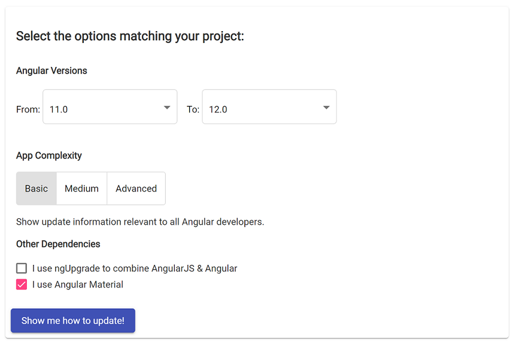
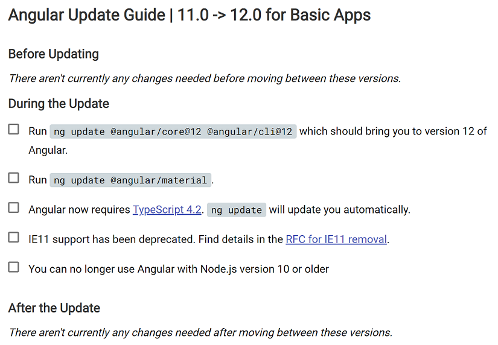
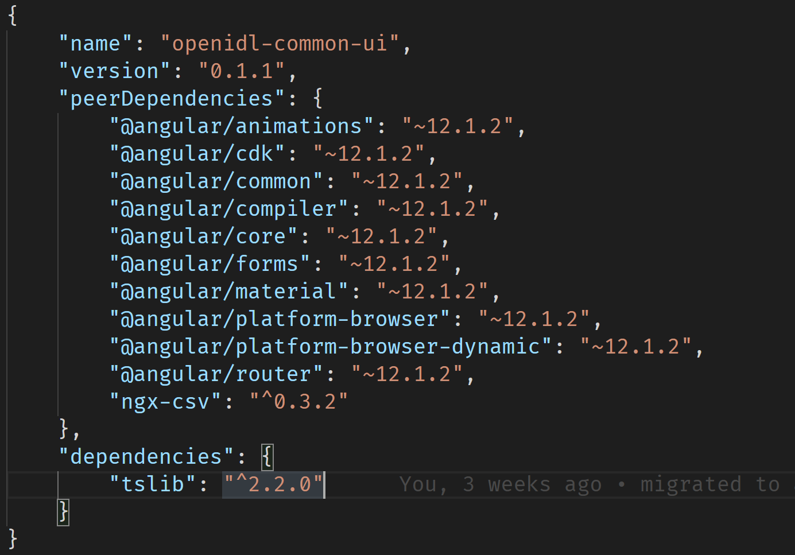

# Angular and Angular Material Packages Upgrade Guide

This is a developer guide for migrating Angular to the latest version. Since we are migrating from v6 to v12, the process will be a bit more time consuming than migrating v11 to v12.

> Note: Delete package-lock.json file and node_modules folder before starting the version upgrade process.

The `openidl-ui-workspace` has 2 angular apps and 1 angular library. Both apps share the same `package.json` file and `openidl-ui` is the default project. That means while running the `ng` command if you don’t specify the project name that command will run against the openidl-ui app.

> **Run all commands from inside the openidl-ui-workspace folder.**

Let's first update angular-cli to the latest version. The best way to do this is to uninstall the old version and then install the new version.

`npm uninstall -g @angular/cli`

To install the latest Angular cli, run the below command.

`npm install -g @angular/cli@latest`

-   Go to the [Angular Update Guide URL](https://update.angular.io/) where the developer can select the current version of the Angular their app is using and the latest version to which they want to migrate.

> Note: Please make sure you have selected a stable version of Angular to migrate.

-   Based on your app complexity there could be extra steps you need to follow to migrate to a new version. Usually Basic or Medium App complexity should be appropriate to migrate to a newer version.
-   If your app is using Angular Material then select the 2nd checkbox “I use Angular Material”. This will show steps to update Angular Material dependencies as well.
-   Common packages that get updated during up-gradation are CLI, Core, TypeScript, Testing Framework, and WebPack configs. Along with those packages sometimes we need to update code to a new API and namespaces to fix deprecated functions.
-   Sometimes Angular team removes support for an older browser, mostly IE browsers. Make sure to keep that in mind while migrating to a new version.

> Note: Make sure you install the recommended version of Node.js before you start the migration steps.

## Angular Library version update

Angular Library has its [package.json](./projects/openidl-common-ui/package.json) file where we need to update the Angular version.

Once the openidl-ui project is upgraded to the latest version, copy the version number from [package.json](package.json) to angular library [package.json](./projects/openidl-common-ui/package.json) file manually or run the below command.

`ng update openidl-common-ui`

We don’t need to run the npm install command inside the `openidl-common-ui` folder, these dependencies will be passed from UI projects.

## Angular v6 to v12 migration experience

-   According to the [migration guide](https://update.angular.io/?v=6.0-12.0), we have 3 high-level tasks to perform which are as follows

    -   Before Updating
    -   During the Update
    -   After the Update

-   Before Updating

    -   We need to update HttpModule to the new HttpClientModule module and HTTP service to HttpClient service.
    -   In the v6 Angular uses RXJS v5 but in the latest version, it uses RXJS v6.

-   During the Update

    -   Angular migration guide will list down all the commands and steps required during the migration process in form of a checklist. These lists may differ from version to version, follow them one by one and click the checkbox to mark your progress.
    -   Most packages can be updated by using the ng upgrade command like below.
        -   `ng update @angular/cli@7 @angular/core@7`

-   After the Update

    -   The ng update command handles most of the package updating tasks. If there are any manual steps involves, they will be listed under this category.

-   Once all the steps are completed, we need to run the `ng build` command to check if there are any compilation errors. If `ng build` runs without error, we must run the application to test manually and check for any errors or warnings in the browser console.
